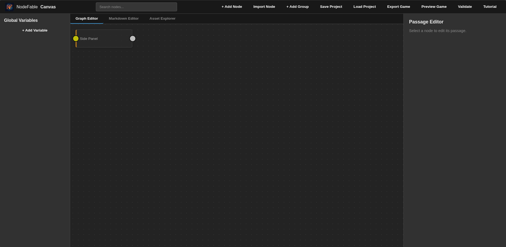
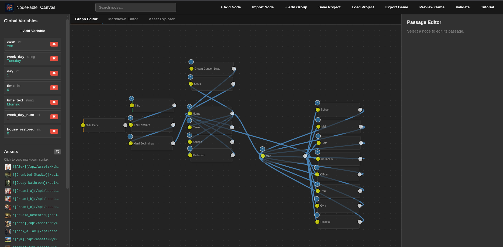
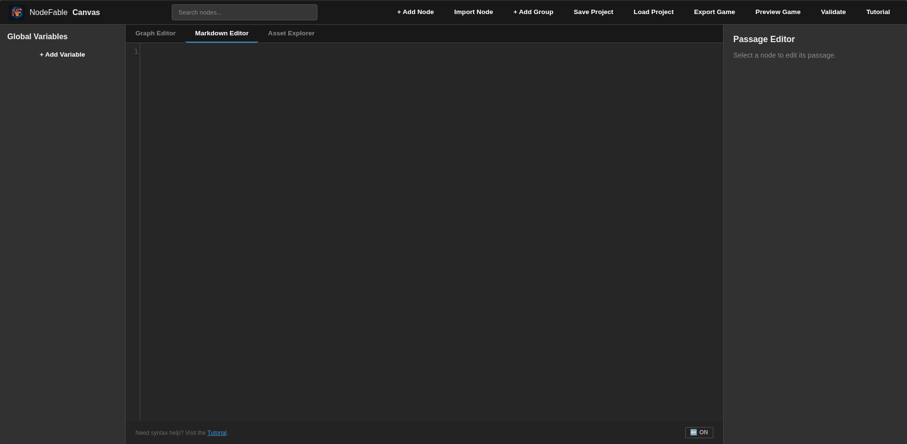
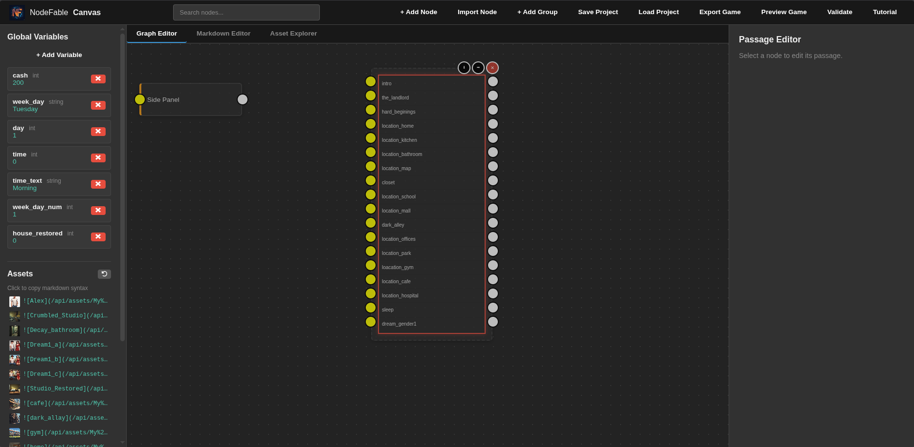
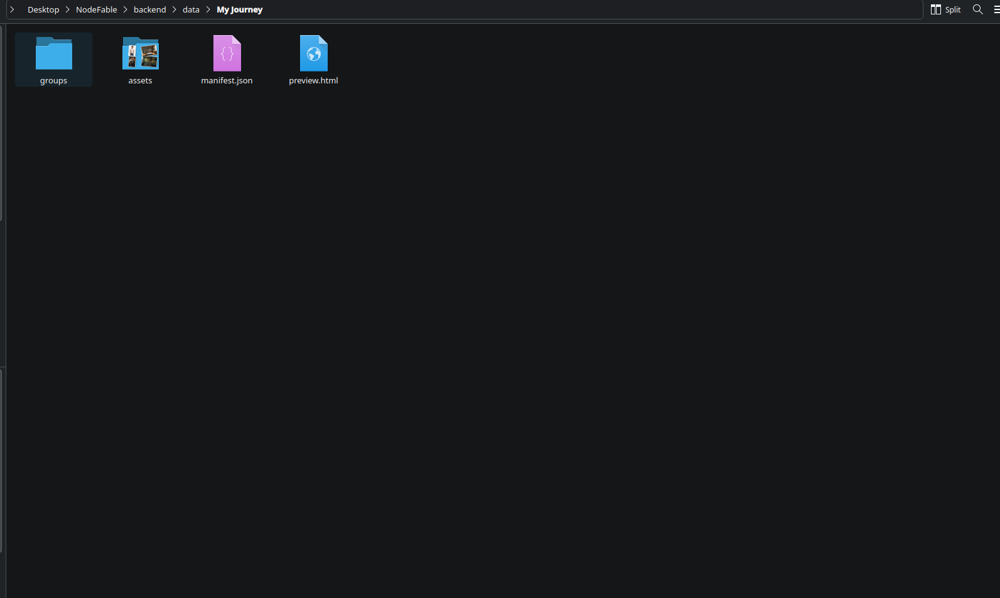
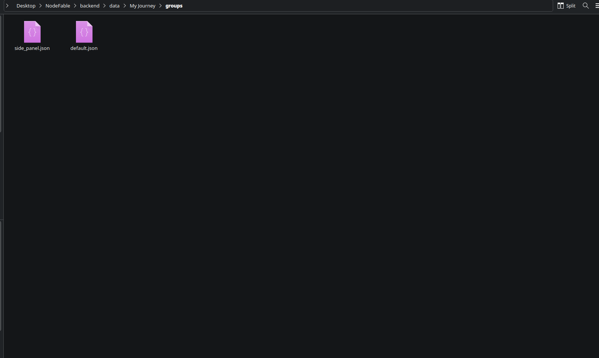
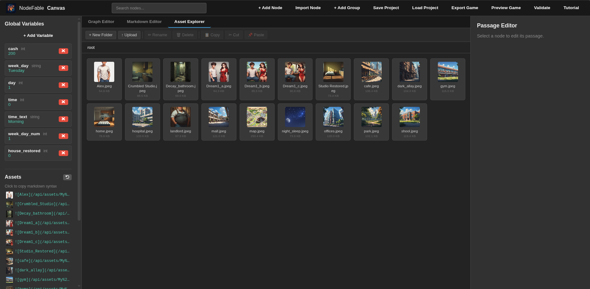

# NodeFable

A self-hosted, visual branching narrative editor for creating interactive fiction where every choice branches the story, changes the world, and shapes the outcome.

NodeFable gives you a node-graph canvas: drag passages around, draw connections between them, and see the entire shape of your story at a glance. No database, no lock-in — everything is flat JSON files.

## Features

### Visual Node Editor

Drag, drop, and connect story nodes on an infinite canvas using Drawflow. See branching paths, dead ends, and loops emerge as you write. Pan by dragging the background, zoom with `Ctrl+Scroll` (0.15x–2.0x), and navigate visually through your entire narrative.



### Node Connections

Draw connections between nodes to define choices. Each connection creates a choice link, automatically synced with your passage content. Add prerequisites and mutations per connection for conditional branching.



### Markdown Code Editor

Full-page CodeMirror editor with syntax highlighting for all NodeFable syntax — `{if:}`, `{set:}`, `{while:}`, `{for:}`, `{wait:}`, `{dialogue:}`, `{img:}`, `{video:}`, `{include:}`, `{var:}`, and more. Auto-complete node slugs, action IDs, variable names, and keywords with `Ctrl+Space`. Supports spellcheck mode and bracket matching.



### Groups & Portal Nodes

Organize your story into groups (chapters, acts, scenes) with collapsible portal nodes. Right-click to load, collapse, or move groups. Chunked loading with progress indicators for large groups. Dashed SVG lines visualize cross-group connections when collapsed.



### File Explorer

Browse and manage your project assets with a full file explorer. Navigate folders, upload images, rename, delete, copy, cut, and paste files. Multi-select with `Ctrl+Click` for bulk operations.



### File Explorer with Groups

Toggle between project file view and group-organized view to manage your narrative structure alongside your assets.



### Asset Explorer

Upload and manage images and videos through the editor UI. Assets are stored alongside your project files. Grid view with thumbnails, folder navigation with breadcrumbs, and one-click copy of `{img: url, alt=...}` (image) or `{video: url}` (video) syntax for insertion into passages.



### Live Preview

Click "Preview Game" to play your story in a new tab. Tweak, re-preview, repeat. Fast iteration without exporting. Auto-saves silently before each preview.


### Narrative Engine

Full runtime engine built into the exported game, no plugins needed:

- **Choices & Actions** — `[text](node:slug)` for navigation, `[text](action:id)` for triggers, with per-choice/action conditions and mutations
- **Conditionals** — `{if: state.hp > 0}...{elseif:}...{else}...{endif}` with arbitrary nesting
- **Loops** — `{while: cond}...{endwhile}`, `{do}...{while: cond}`, and C-style `{for: init; cond; update}...{endfor}`, with `{break}` and `{continue}`
- **Variable Mutations** — `{set: state.gold += 10}` inline or structured in choices/actions/on-enter; `{unset: state.name}` deletes a variable
- **Scratch Variables** — `temp.*` for short-lived values that never persist to saves
- **Redirects** — `{redirect:slug}` and structured `on_enter` with condition and mutation
- **Passage Includes** — `{include: slug}` splices another passage's text in, merging its choices and actions
- **One-Time Setup** — `{init}...{endinit}` runs mutations once per fresh entry and produces no output
- **Wait Sequences** — `{wait:2000,fade:500}text{endwait}` for timed text reveals
- **Dialogue Blocks** — `{dialogue: Name}text{enddialogue}` with optional image avatars (`{dialogue: {img: url}, Name}`)
- **Images** — `{img: url, w=200, h=300, alt=...}` with optional pixel dimensions and alt text
- **Video** — `{video: url, autoplay, repeat, mute, w=480, h=270}` native player with controls
- **Form Elements** — `{textfield:}`, `{textarea:}`, `{number:}`, `{checkbox:}`, `{dropdown:}`, `{radiogroup}` for player input during gameplay
- **Random Numbers** — `{random:max}` or `{random:min,max}` for chance events
- **Variable Interpolation** — `{var:state.player_name}` displayed in text
- **Notifications** — `notify("message")` and auto-detection of state changes with formatted diffs
- **Side Panel** — Persistent HUD node rendered alongside all passages
- **History** — Forward/back navigation with full browsing history stack
- **Save/Load** — 6 save slots (1 auto + 5 manual) with `localStorage`
- **Auto Notifications** — State changes auto-display as toast notifications (e.g., "Health +10", "Gold -5")

### Standalone Export

Export your story as a ZIP containing a single self-contained HTML file with inlined assets. Send it to friends, host it anywhere, no server required.

### Additional Editor Features

- **Undo/Redo** — `Ctrl+Z` / `Ctrl+Shift+Z` with 50-snapshot history
- **Node Search** — Filter nodes by title or slug with 150ms debounce
- **Dead-End Detection** — Red border on nodes with no outgoing paths
- **Orphan Detection** — Gold dashed border on unreachable nodes
- **Visual Badges** — Green border for start node, orange for side panel
- **Import Nodes** — Paste JSON to import nodes with validation
- **Slug Change Propagation** — Renaming a slug auto-updates all references
- **Keyboard Shortcuts** — `Ctrl+S` to save, `Delete` to remove nodes, `Escape` to cancel/close
- **Context Menu** — Right-click nodes for quick actions
- **Chunked Loading** — Adaptive batch loading for large stories with progress indicators

## Quick Start

Requires Python 3.9+.

### Linux / macOS

```bash
python3 -m venv venv
source venv/bin/activate
pip install -r requirements.txt
./run_dev.sh
```

### Windows (PowerShell)

```powershell
python -m venv venv
venv\Scripts\activate
pip install -r requirements.txt
uvicorn backend.main:app --host 127.0.0.1 --port 8005
```

This starts the server on `http://localhost:8005` — open it in your browser to use the editor.

## How It Works

Stories are composed of **nodes** (passages) connected by **choices**. Each node contains rich text content with markdown-style formatting. Writers use a lightweight syntax to create links between nodes, define variable mutations, and control conditional visibility.

A node's text can include:

- `[Go to forest](node:forest)` — a choice link to another node
- `[Bribe guard](action:a0)` — an action link that triggers variable changes
- `{if: state.gold >= 10}Rich!{else}Broke.{endif}` — conditional text
- `{for: state.i = 0; state.i < 3; state.i += 1}{var: state.i}{endfor}` — C-style loops
- `{while: state.hp > 0}...{endwhile}` — conditional loops
- `{set: state.hp -= 10}` — inline variable mutation
- `{wait:2000}...{endwait}` — timed fade sequences
- `{dialogue: Bob}Hello!{enddialogue}` — dialogue blocks with speaker name
- `{img: assets/alex.png, w=200}` — images with optional dimensions
- `{video: assets/rain.mp4, w=480, autoplay=false}` — video player
- `{include: prologue}` — splice another passage into this one
- `{init}...{endinit}` — one-time setup block
- `{var:state.player_name}` — variable interpolation
- `{textfield: state.name, Enter name, onEnterKey}` — single-line player input
- `{textarea: state.bio, Your story..., blur, 5}` — multiline input
- `{number: state.age, 1, 150}` — numeric stepper
- `{dropdown: state.class, warrior, mage, rogue}` — option picker
- `{checkbox: state.flag, value}` — toggle checkbox
- `{random:1,6}` — random number generation
- `{redirect: cave_entrance}` — auto-redirect to another node

Variables, choices, actions, and on-enter redirects give you the building blocks for complex interactive narratives: stat checks, branching dialogue, timed events, shops, combat, and more.

## Tech Stack

- **Backend:** Python, FastAPI, uvicorn
- **Frontend:** Vanilla JavaScript (ES modules), Drawflow 0.0.60, CodeMirror
- **Storage:** Flat JSON files (no database)
- **Dependencies:** fastapi, uvicorn[standard], python-multipart

## Project Structure

```
NodeFable/
  backend/
    main.py              -- FastAPI server (API endpoints)
    schemas/
      project.py         -- Pydantic models for project data
    data/                -- Project files (gitignored)
  frontend/
    editor/
      index.html         -- Editor application page
      app.js             -- Entry point that imports the editor's ES modules
      js/                -- ES modules (state, node editor, graph engine, asset explorer, ...)
      lib/               -- Vendored libraries (CodeMirror 5, Drawflow)
      template.html      -- Export/preview game template
      template_styles.css-- Styles for exported games
      tutorial.html      -- In-editor tutorial
      Assets/
        Screenshots/     -- Project screenshots
  docs/                  -- Technical documentation
  features/              -- Feature implementation plans (local, not committed)
  run_dev.sh             -- Development server launcher
  requirements.txt       -- Python dependencies
```

## License

MIT -- see [LICENSE](LICENSE) for details.
